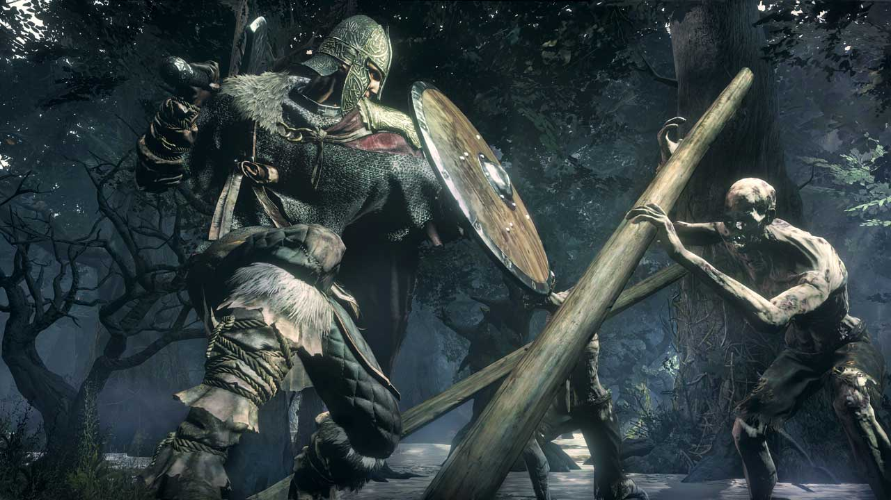
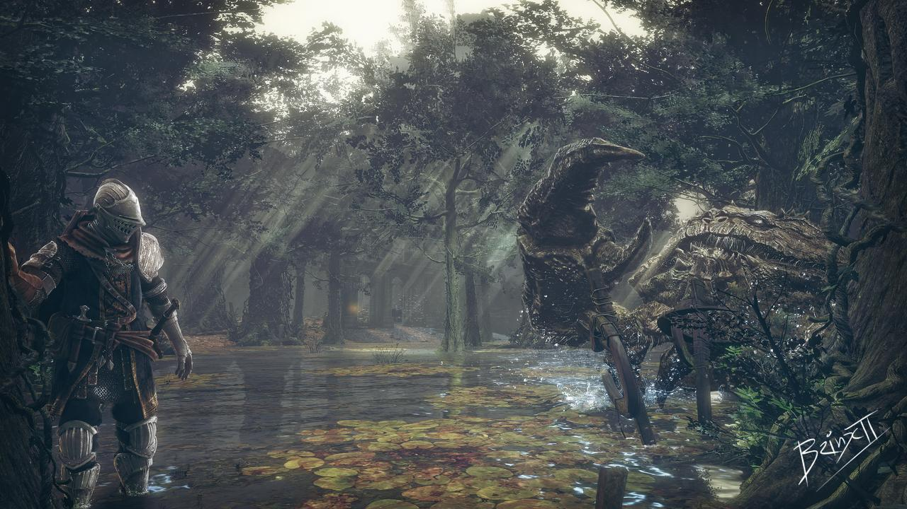

#Game Design Journal: Level Design Assessment

##Game: Dark Souls 3

I picked up dark souls almost two years ago so it may have taken me some time,
but now I feel like I'm finally moving along the learning curve that's infamously steep in souls games.
And now because they're more accessible to me I can at least begin to put some thought into the formula behind the famous design of these games. Specifically today I'll be looking at
an area called "Halfway Fortress", an area just beyond what I would call the introduction of the game and I'm assuming about halfway to the first great milestone: the cathedral of one of the lords of cinder.

In this blurb I'll be talking about the different features and aspects of the area that apply to level design principles we've discussed, and how they contribute to the trademark souls gameplay loop. Originally I was going to use specific picture aids, but the game doesn't like you taking screenshots and there aren't many good ones online. So I'll try to keep things general.

Right off the bat we have a weenie. A big, looming tower that's visible right outside the exit of the bonfire area. Two NPCs right at the start will tell you about Aldritch, the terrible saint of the deep who lives there, and you know by that description you definitely want to go there next. This is some call to action for the player, and indirectly readies them for the next part of the game.

Areas in Dark souls also have many tiny motifs and mechanics that get focused on. The simplest and first one you encounter is the use of "spearmen". The area you are venturing into is called the "Crucifixion Woods", so you encounter enemies with giant wooden stakes. These aren't like previous enemies though, and can likely kill you if they get a direct hit in. So right off the bat the level sends two of them at you to show you what they can do before you later run into bigger packs at the bottom of the hill. Later on this returns in the ruined castle bits where the same enemies are reskinned, tougher, and have shields.\

Another element of this level is the enormous swamp that covers most of the ground area. And in that swamp are these little harmless crabs, and lots of treasure! Just sitting there! Sweet!
Except of course as soon as you turn your back an enormous crab has scuttled up behind you and is ready to decimate an inexperienced player. The swamp connects several structures in the level, so even if you caught on you'll need to run through the swamp in order to progress. This looming danger is kept going by having multiple giant crabs in different areas of the swamp, although I could have sworn it was just one crab that kept sneaking up behind me.
Disclaimer though, I never got completely surprised because I saw a warning message left by another player, "Deadly monster ahead". Anyway, this challenge intertwines with all of the other challenges posed to the player in a very unique way.

Lastly, most souls stages give you the option to simply run past enemies. In this stage if you don't want to deal with the spearman mob at the base of the hill you can roll off the side into a forest full of poisonous moss-plant things. They move slowly and don't hit hard, but instead release poisonous gas and rely on numbers to overwhelm the player. If poisoned, the player will be losing health and have a much harder time with the enemies they were avoiding once they return to the path, making this shortcut a calculated risk.

Anyway, I don't want to get too long winded with this. Dark Souls levels are different and more complex than super mario levels, but many of the same design characteristics are there. Halfway fort gives the player a goal, guides them, and interweaves many different gameplay motifs in a cadence to create a difficult but engaging experience. 

